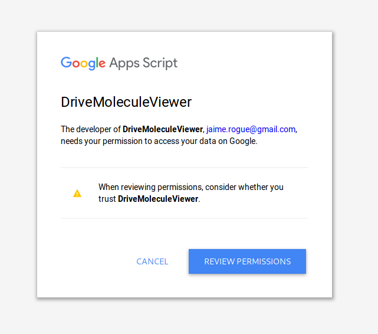
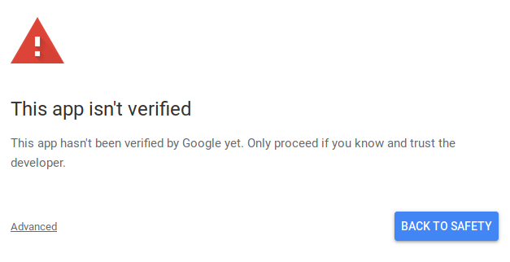
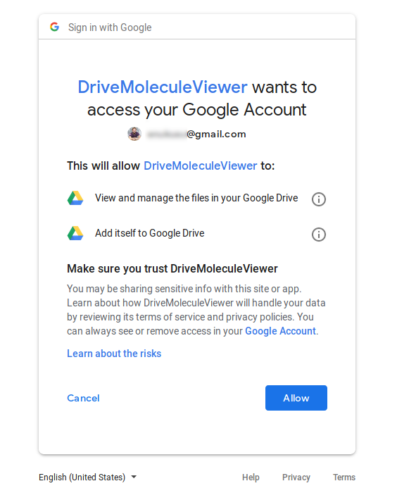
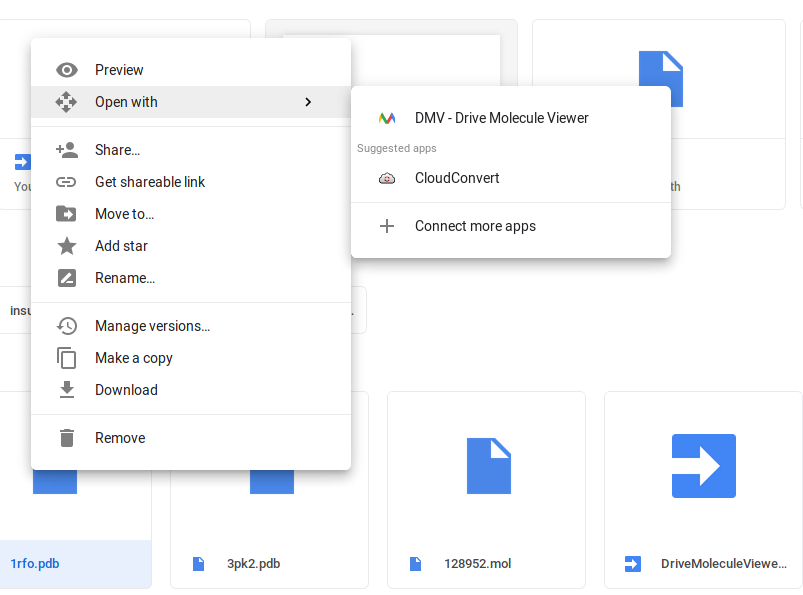
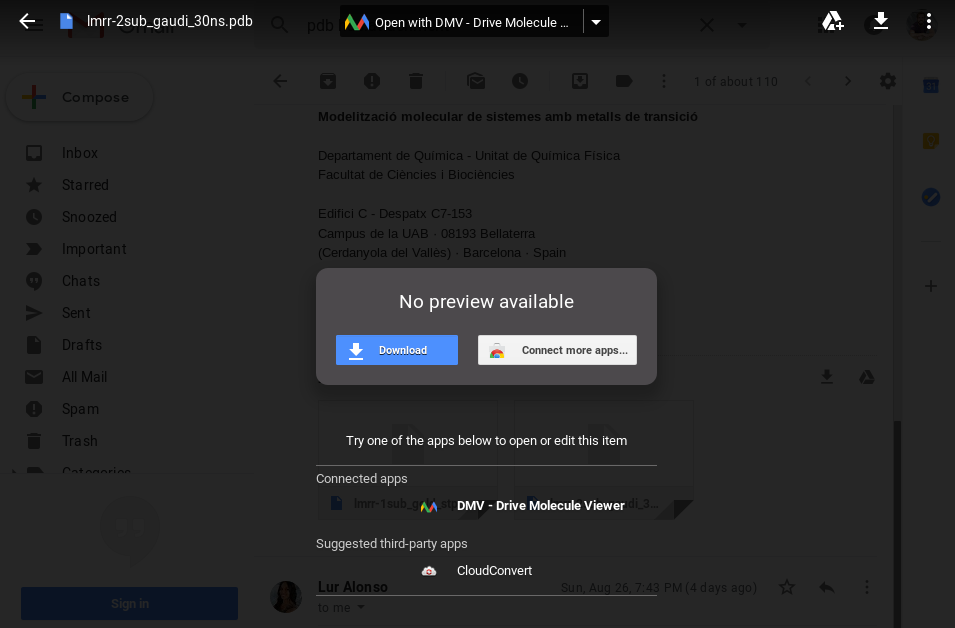
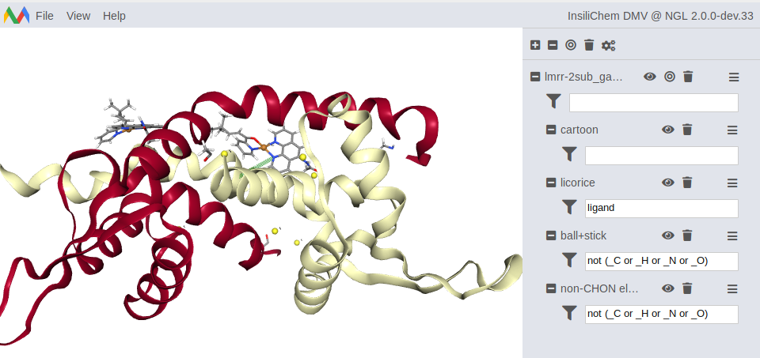

# DMV: Drive Molecule Viewer

DMV is a Google Drive and Gmail addon to view molecular structures (PDB, Mol2...) in the browser, without having to download the files to disk nor installing anything.

**Note**: If you do not care about contextual details, feel free to skip to section [Configuration & Usage](#configuration-usage) right way.

# Why

My PhD in Biotechnology had a strong focus on computational chemistry and molecular modeling. As a result, many of my email correspondence consists of attachments like PDB, XYZ or Mol2 files. These file formats contain information to depict 3D molecular structures suitable for interactive visualization. However, viewing them means downloading them to disk and opening with specialized software like:

- [UCSF Chimera](https://www.cgl.ucsf.edu/chimera)
- [PyMol](https://pymol.org/2/)
- [VMD](https://www.ks.uiuc.edu/Research/vmd/)
- [Avogadro](https://avogadro.cc/)

Most of the time, you only want to have a quick look, though. Since I hate convoluted folders (and `~/Downloads` is one the worst), I created a small Google Drive addon that allows you to see these files in-browser. It relies on the excellent [NGL viewer](http://nglviewer.org/#ngl) and the free [Google Script platform](https://www.google.com/script/start/). Source code is available in [my GitHub profile](https://github.com/jaimergp/drive-molecule-viewer).

# Configuration & Usage

## Configuration

No actual installation is needed. You only need to register the addon within your account.

1. Go to the [Drive Molecule Viewer app](http://dmv.insilichem.com). If you are not logged in with a Google account, it will prompt you now. Then, Google Apps Script (the server platform behind DMV) will warn about the permissions. Click on `Review permissions`. 

2. Since DMV is still alpha, I have yet to register the addon in the Google directory. As a result, it will first tell you that the script is potentially insecure. At the bottomo, click on `Advanced` and follow the *unsafe* link. 

3. Then, it will prompt for permissions to register in your Google Drive profile. It needs full access to your Drive files (I still have to figure out how to make it work with read-only permissions), but it won't touch anything. If you don't trust me, [check the source](https://github.com/jaimergp/dmv)! 

3. After that, you will reach the web UI. From now on, the app will be available as an `Open with` entry in the contextual menu of compatible files. This includes both Drive files and Gmail attachments! 

## Standalone usage

The app can also be loaded separately from Google Drive or Gmail. Simply go to [Drive Molecule Viewer](http://dmv.insilichem.com) and click on `File` to see all options. Easiest way is to simply drag & drop the files from your local disk.

## Open attachments in your smartphone

The Gmail app does not offer an `Open with` menu. As a result, if you want to open a molecule attachment from the app, you have to manually save it to your Drive files. Then, you can go to the Drive app and open the newly created file as usual. The Drive Molecule Viewer will load the file automatically.

## Supported files

DMV will load all the file formats supported by [NGL](https://github.com/arose/ngl), including:

- PDB
- MOL
- MOL2
- SDF
- MMCIF

# Help & Support

Should you have any doubts, questions or suggestions, feel free to [submit an issue](https://github.com/jaimergp/dmv/issues) in the GitHub repo. I will post about new updates in my [Twitter account](https://twitter.com/jaime_rgp).